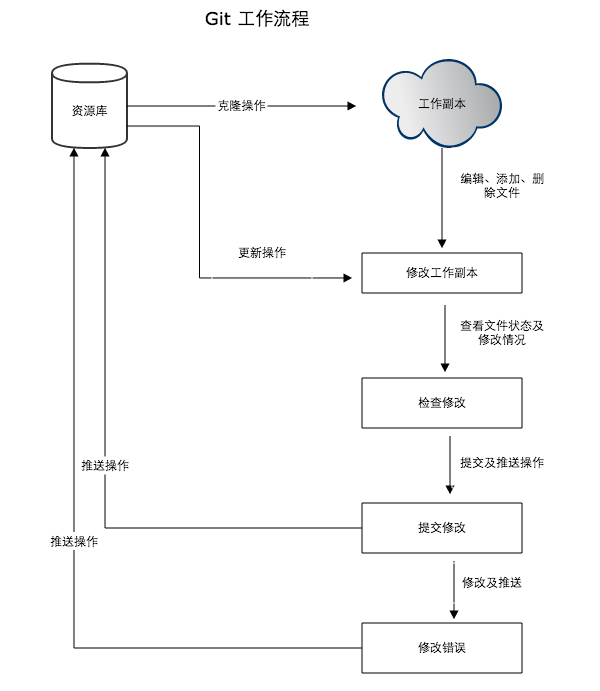

> Git是一个开源的分布式版本控制系统，用于敏捷高效的处理或大或小的项目。
## Git和SVN的区别
> git 不仅是版本控制系统，还是个内容管理系统，工作管理系统。

**区别**
- git是分布式的，SVN不是
- git把内容按元数据方式存储，svn按文件存储
- git和svn分支不同
- git没有一个全局版本号，svn有
- git的内容完整性要由于svn

## Git工作流程
- 克隆git资源作为工作目录
- 在克隆的资源上添加修改文件
- 如果其他人有修改文件，我们可以更新资源
- 提交前查看修改
- 提交修改
- 在修改完成后，如果发现错误，可以撤回提交并修改再提交



## 基本概念

- 工作区：就是本地克隆后生成的目录。
- 暂存区：一般存放在.git目录下的index文件中，也叫索引。
- 版本库：工作区有一个隐藏目录.git，这个即为git版本库

## 基本操作
####创建仓库
> git init 
```shell
$ git add *.c
$ git add README
$ git commit -m '初始化项目版本'
```
> git clone

> git config
```jshelllanguage
 git config --list   //显示当前配置信息
 git config -e       //针对当前仓库
 git config -e --global  //针对系统上所有仓库
 -------------------------
 $ git config --global user.name "runoob"
 $ git config --global user.email test@runoob.com
```
####提交与修改
> git add 
> git status
> git diff
> git commit 
> git reset
> git rm
> git mv
#### 提交日志
> git log
> git blame
#### 远程操作
> git remote
> git fetch
> git pull
> git push 

> git checkout

